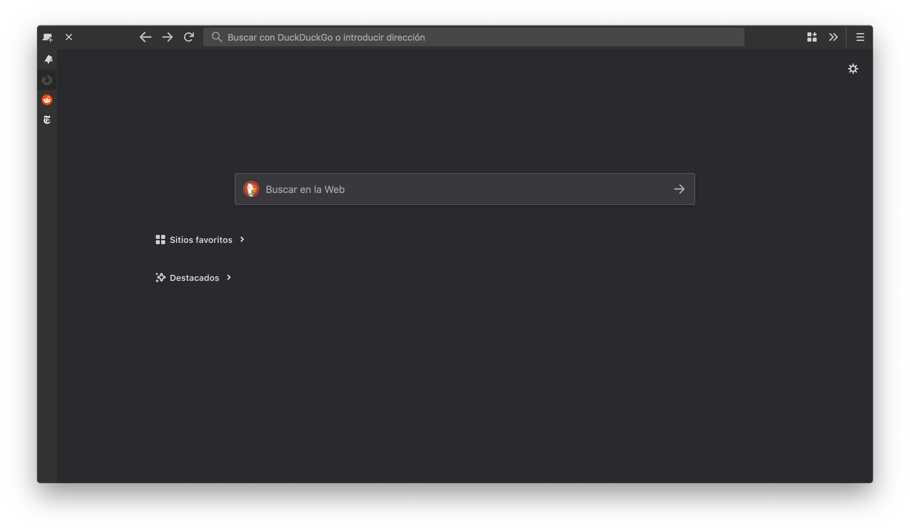
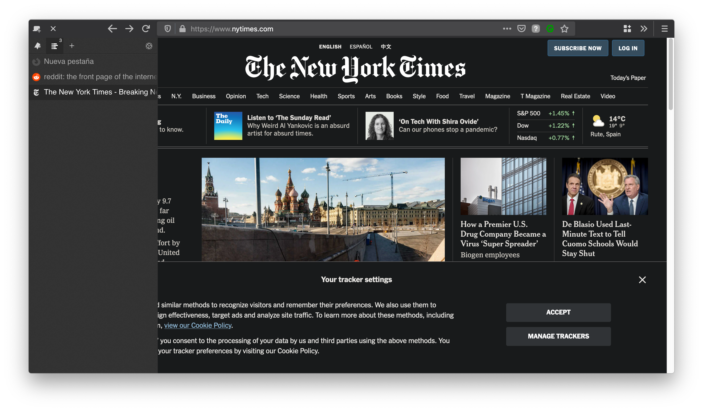
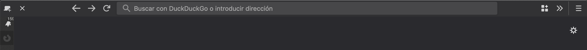

# firefoxTheme1

### Firefox UI customization for 75.0+ version

<br>

This theme requires the Firefox addon [**Sidebery**](https://github.com/mbnuqw/sidebery)

[](https://addons.mozilla.org/en-US/firefox/addon/sidebery/)

Additionally I also use the addon **Simple New Tab Button**
[](https://addons.mozilla.org/en-US/firefox/addon/simple-new-tab-button/)




### Installation
In ```about:config```:
```css
toolkit.legacyUserProfileCustomizations.stylesheets; set to True (for custom themes to work)
```

Type ```about:support``` in your search bar. Navigate to ```Profile Folder``` and click on ```Show in file explorer```. Go into that folder and enter or create a new folder called ```chrome```. Paste there the file ```userChrome.css``` and restart your browser.

### Tested on
```html
MacOS Mojave 10.14.6 with Firefox 75.0 (64-bit)
```

### Customization
Comment this to show min/max/close buttons and show the default tab bar:
```css
#TabsToolbar{ visibility: collapse !important }
```

I use Flexible space for spacing:
```css
/* Width flexible spacer (separator) */
toolbarspring {
  min-width: 80px !important;
}
```
From:
```
https://www.reddit.com/r/FirefoxCSS/comments/8kt4k1/nav_bar_small_flexible_spaces_or_separators/dzabm5l/
```




To enable pinch to zoom in MacOS:
```css
apz.allow_zooming; set to True
```
```
https://www.reddit.com/r/firefox/comments/bcebze/its_2019_when_will_firefox_support_smooth_pinch/erimc1y/
```

### Did I made this from scratch?
**No**

Base code:
```
https://www.reddit.com/r/FirefoxCSS/comments/ep8r6j/side_tabs_on_hover_using_sidebery_addon/fhblk1c/
```

Searchbar semi-transparent background:
```
/* Lines 240-249 */
https://github.com/datguypiko/Firefox-Mod/blob/master/userChrome.css
```

I used this comment next to the code I modified:
```css
/* Own modification */
```
